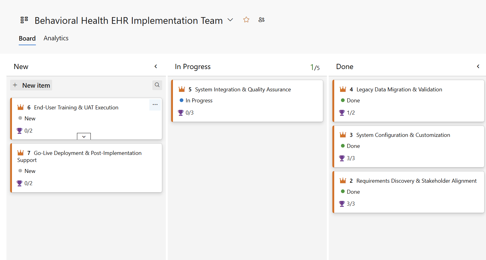
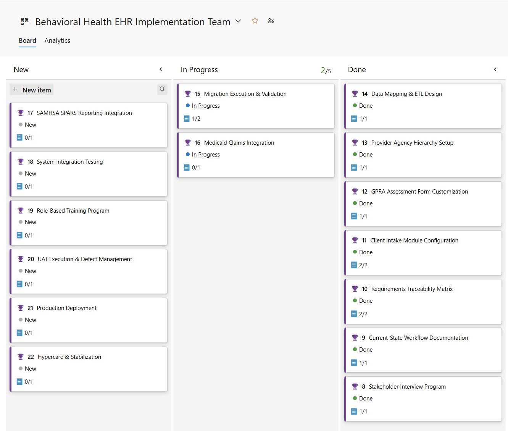
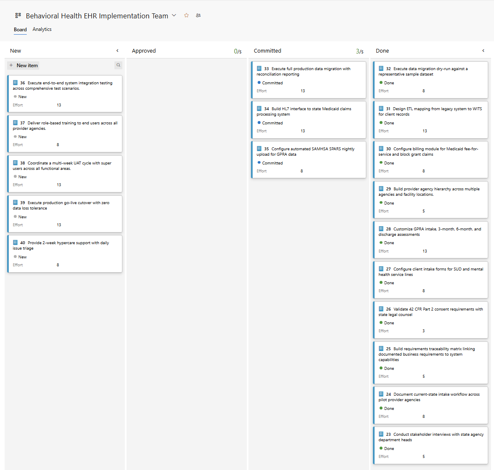
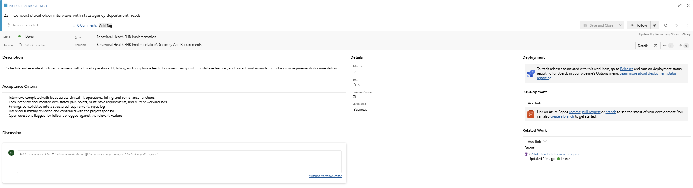
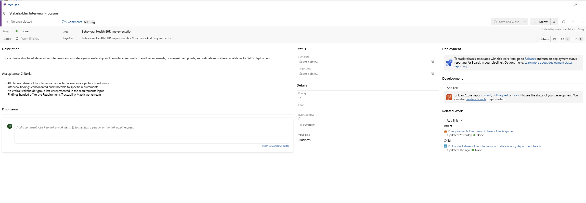
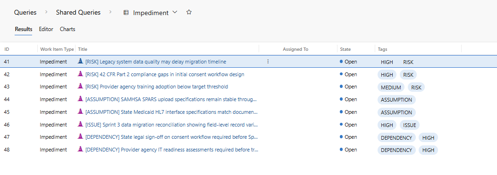
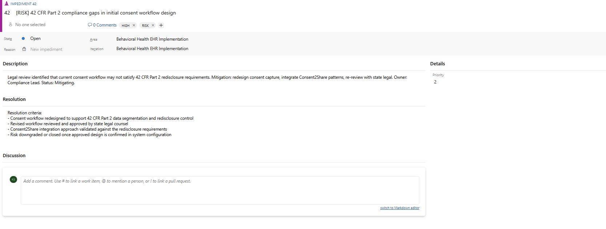
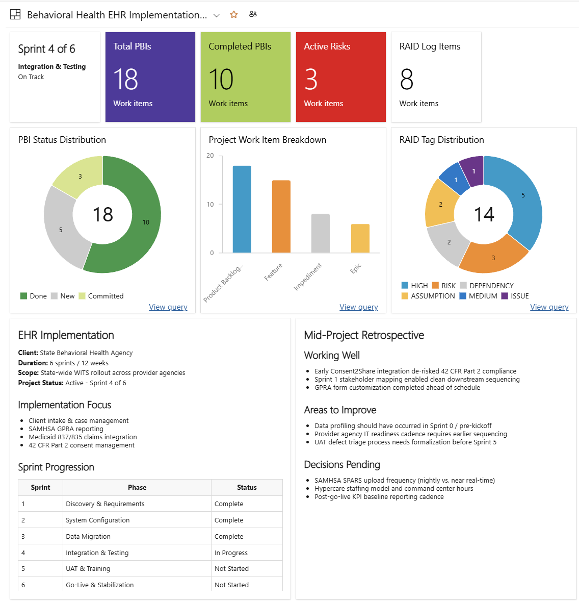
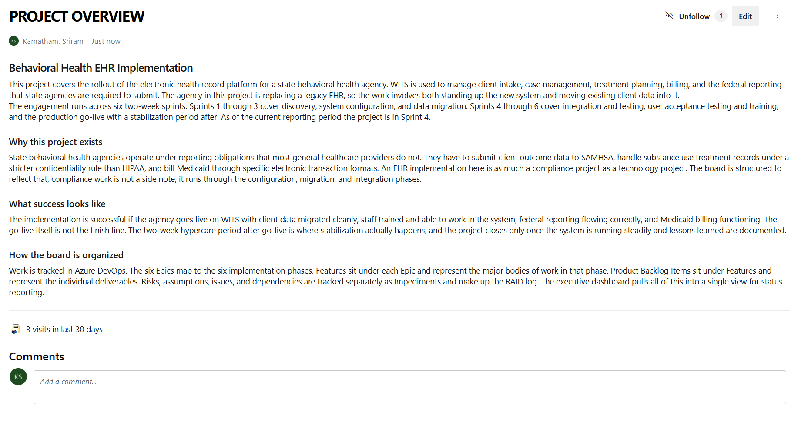
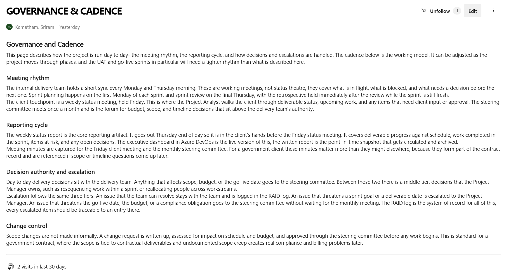

# Behavioral Health EHR Implementation - PMO Governance Project

A simulated Project Management Office (PMO) governance project built in Azure DevOps, modeling the Project Analyst workflow for a state behavioral health agency implementing a behavioral health EHR and case management platform. The scenario is informed by publicly available context on WITS / Blue Compass and government health IT delivery.

This project was built to demonstrate end-to-end PMO execution in a government health IT context - backlog structure, work item governance, RAID management, executive reporting, and project documentation.

Disclaimer: This is an independent portfolio simulation. It is not affiliated with any software/company or any state agency. It does not use proprietary data, internal documentation, client materials, or non-public system knowledge. The scenario is based on publicly available health IT context and the PMO responsibilities.
---

## What this project is

This is a portfolio project, not a record of a live client engagement. It simulates how a Project Analyst within a PMO would structure, track, and report on a complex healthcare IT implementation.

The scenario is a state behavioral health agency replacing its legacy system with a behavioral health EHR and case management platform, using publicly available WITS / Blue Compass context as a reference point. The simulated platform supports workflows such as intake, case management, treatment planning, billing, and federal performance reporting.. The project is structured the way a real government health IT implementation would be, because an EHR rollout in this space is as much a compliance project as a technology project.

Every artifact in the project - the board, the RAID log, the dashboard, the wiki - was built by hand. The structure, work item content, governance model, and compliance framing reflect deliberate decisions, each of which is documented and defensible.

---

## The scenario

| | |
|---|---|
| Client | State behavioral health agency (simulated) |
| Platform | Behavioral health EHR / case management platform, informed by public WITS / Blue Compass references |
| Engagement shape | 6 sprints, two weeks each, across a 12-week implementation |
| Current state | Mid-execution - Sprint 4 of 6 |
| Tooling | Azure DevOps (Boards, Dashboards, Wiki, Queries) |

The six implementation phases: Requirements Discovery, System Configuration, Data Migration, Integration and Testing, UAT and Training, and Go-Live with Stabilization.

---

## How the project is structured

The Azure DevOps board uses a four-level work item hierarchy:

- **6 Epics** - the six implementation phases
- **15 Features** - the major bodies of work within each phase
- **18 Product Backlog Items** - the individual deliverables, each estimated in story points and linked to a parent Feature
- **8 Impediments** - the RAID log, covering risks, assumptions, issues, and dependencies

Work item states reflect a project in mid-execution. Sprints 1 through 3 are complete, Sprint 4 is in progress, and Sprints 5 and 6 are ahead.

### Epic board

The six implementation phases, with states reflecting current progress.

### Features

Fifteen Features distributed across the six Epics, each linked to its parent and carrying its own state and child count.

### Product Backlog Items

Eighteen PBIs across New, Committed, and Done states, each with an effort estimate and a parent Feature.

---

## Work item depth

Each work item carries a description, acceptance criteria, an effort estimate where applicable, and parent and child links. The board is not a set of titles - every item is built out.

### Example - Product Backlog Item

A PBI with description, acceptance criteria, effort estimate, and parent link.

### Example - Feature

A Feature showing its acceptance criteria, parent Epic, and child PBI.

---

## RAID log

Risks, assumptions, issues, and dependencies are tracked as Impediments, tagged by category and severity. Three of the eight items are healthcare-compliance specific - they cover 42 CFR Part 2 consent requirements, SAMHSA reporting stability, and Medicaid interface assumptions.

### Example - RAID item

A risk item with mitigation approach and defined resolution criteria.

---

## Executive dashboard

A single reporting view built from shared queries. The top band carries the headline metrics - sprint position, backlog size, completion, active risks, and total RAID items. Below it, three charts show backlog status, work item composition, and RAID profile. Two narrative panels carry the project snapshot and a mid-project retrospective.

The dashboard deliberately does not include a sprint burndown. Burndown is calculated from historical state-change data, and without genuine day-by-day progression that chart would mislead the viewer. Knowing when not to use a metric is part of the reporting discipline.

---

## Project documentation

The project includes an Azure DevOps wiki covering four areas: a project overview, the governance and cadence model, the work item conventions used on the board, and notes on the compliance concepts referenced in the RAID log.

### Project Overview

### Governance and Cadence

The governance model defines the meeting rhythm, reporting cycle, decision authority, escalation tiers, and change control process.

---

## Compliance context

Three federal frameworks shape this implementation and appear directly in the RAID log:

**42 CFR Part 2** is the federal regulation protecting the confidentiality of substance use disorder treatment records. It is stricter than HIPAA, particularly on redisclosure - substance use treatment information generally cannot be shared onward without specific patient consent. A consent workflow built only to HIPAA standards does not satisfy it.

**SAMHSA SPARS** is the federal system through which state agencies submit performance and outcome data for SAMHSA-funded programs. The simulated implementation assumes a reporting workflow where completed client assessment data must be prepared for SAMHSA SPARS submission..

**Medicaid 837 and 835 transactions** are the standardized electronic formats for submitting claims and receiving remittance. States publish companion guides specifying how these transactions must be formatted.

These are not decorative references. Each one is represented on the board as a real work item with a risk or assumption attached, which keeps the compliance work visible rather than buried in the technical detail.

---

## Tools used

Azure DevOps — Boards, Backlogs, Sprints, Queries, Dashboards, and Wiki.

---

## A note on scope

This is a simulation built for portfolio purposes. The client is representative rather than real, and the project parameters were chosen to reflect a realistic mid-complexity state behavioral health implementation. The value of the project is in the PMO methodology, the tool fluency, and the governance structure - all of which transfer directly to a live engagement.
